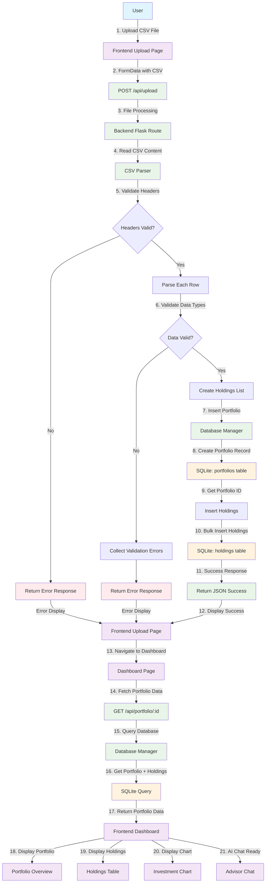
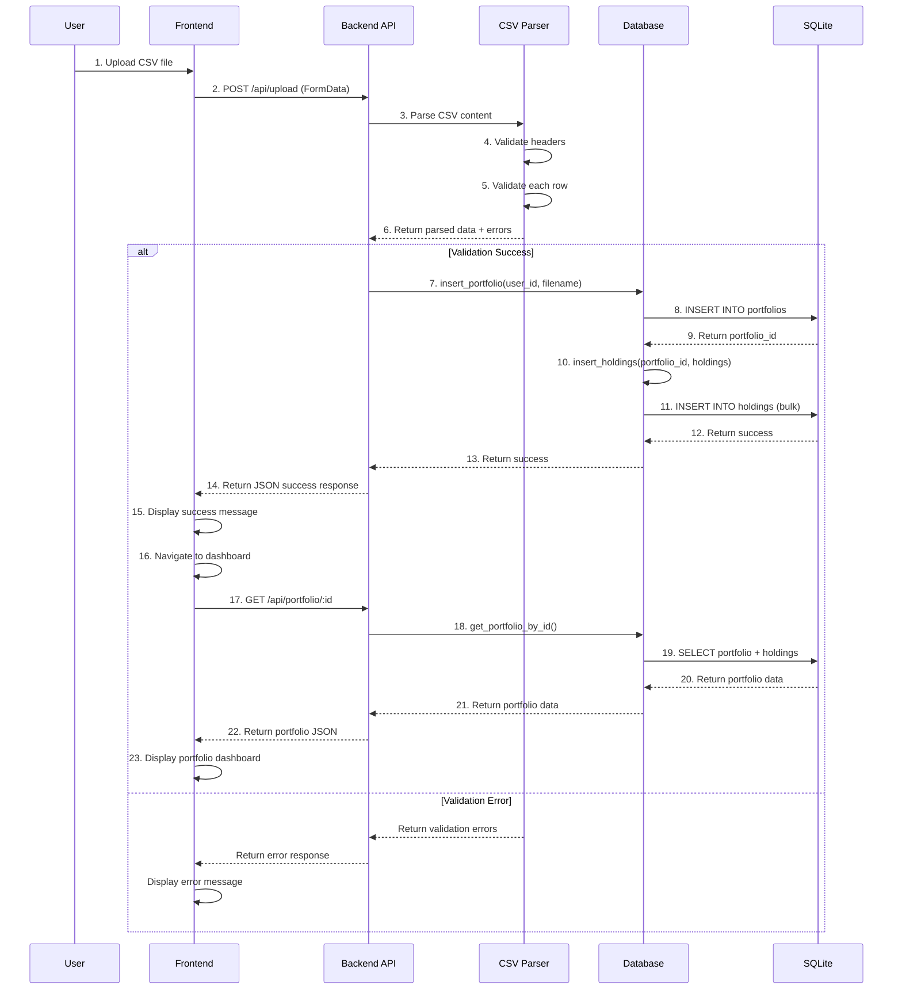
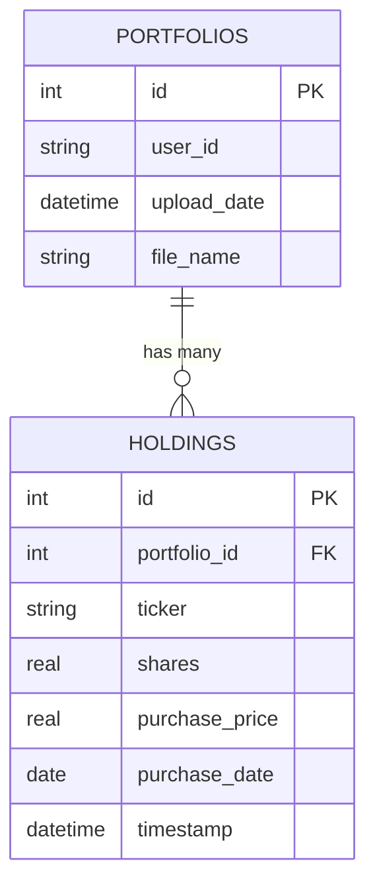
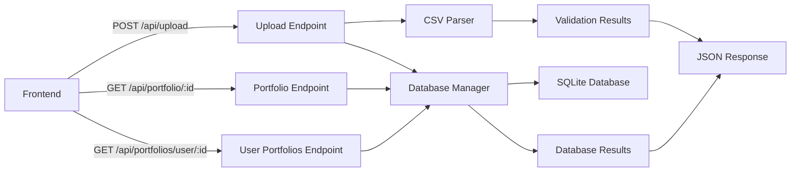
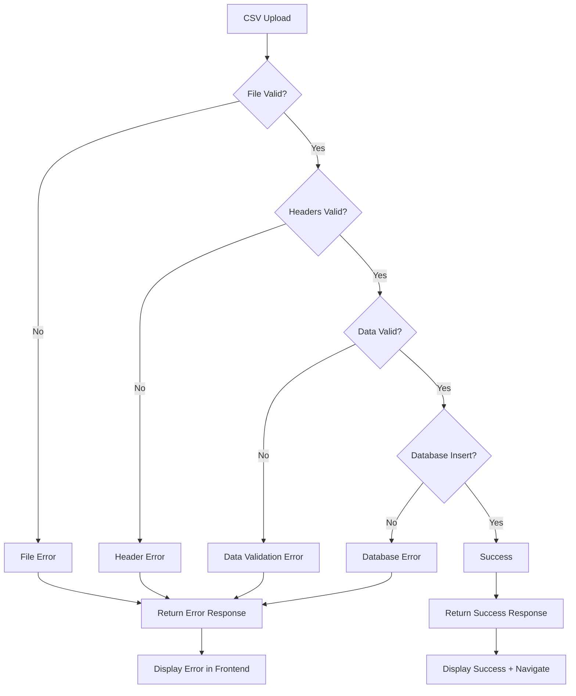

# Captura Data Flow Documentation

This document illustrates the complete data flow for portfolio CSV upload and management in the Captura application.

## CSV Upload and Portfolio Management Flow



## Detailed Component Flow



## Database Schema Integration



## API Endpoints Flow



## Error Handling Flow



## File Structure Integration

```
backend/
├── app.py                 # Flask application
├── routes/
│   └── api_routes.py     # API endpoints
├── utils/
│   ├── csv_parser.py     # CSV parsing & validation
│   ├── database.py       # Database operations
│   └── file_utils.py     # File handling utilities
├── database_schema.sql   # Database schema
├── captura.db           # SQLite database (auto-created)
└── DATA_FLOW.md         # This documentation

frontend/
├── src/
│   ├── pages/
│   │   ├── HelloPage.js  # Upload page
│   │   └── Dashboard.js  # Portfolio dashboard
│   └── components/       # Dashboard components
```

## Key Data Transformations

1. **CSV File** → **Parsed Holdings List**
   - Raw CSV content → Validated dictionary objects
   - Type conversion (strings → numbers, dates)
   - Business rule validation

2. **Holdings List** → **Database Records**
   - Portfolio metadata creation
   - Bulk holdings insertion
   - Foreign key relationships

3. **Database Records** → **Dashboard Display**
   - Aggregated portfolio statistics
   - Holdings table data
   - Chart data preparation

## Performance Considerations

- **Bulk Insert**: Holdings are inserted in a single transaction
- **Indexing**: Database indexes on frequently queried fields
- **Connection Management**: Context managers for safe database connections
- **Error Recovery**: Graceful handling of partial failures
- **Validation**: Early validation to prevent unnecessary database operations
